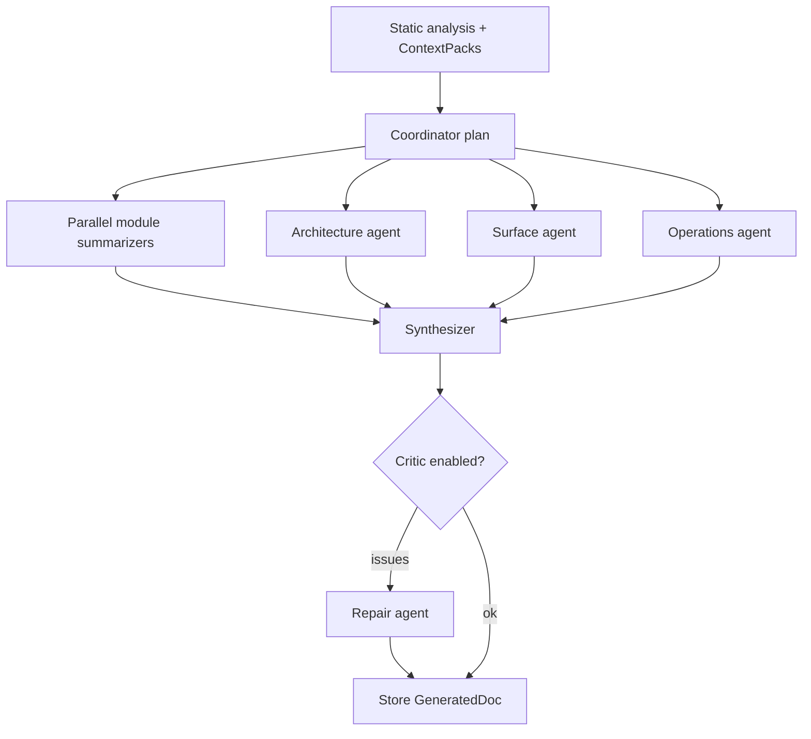

# Wovn v2 — Plan

## Purpose

Extend the MVP (single-tenant SQLite, public repos, two-stage LLM pipeline: summarize → synthesize) with **identity**, **durable per-user repo records**, **richer static context for models**, and a **multi-agent generation workflow**—while keeping BYOK, skeleton-first cost control, and no execution of cloned code.

## v2 goals

| Theme | Outcome |
| --- | --- |
| Auth | Signed-in users; GitHub-linked access for private repos; user-scoped settings and jobs |
| Per-user repos DB | Register repos once; history of runs; optional pinned default branch; foundation for re-sync |
| Context | Models see structure *and* targeted excerpts (routes, types, configs) with explicit provenance |
| Multi-agent | Specialized agents with a coordinator; review pass before publish |

## Non-goals (v2)

- Running user code in sandbox (still static analysis only)
- Non-Groq providers (stay BYOK Groq unless explicitly reopened)
- Full incremental “live wiki” on every push (design DB for it; ship webhook re-sync as v2.1+ if scoped)
- Team/org billing and RBAC beyond “owner + optional share link” (v3 candidate)

---

## 1. Authentication & authorization

### 1.1 User identity

- **Primary**: OAuth sign-in (GitHub first—needed for repo access anyway; email/password or magic link optional later).
- **Sessions**: HTTP-only secure cookies for the web app; API accepts session cookie or short-lived API token for automation.
- **Backend**: FastAPI dependency `get_current_user()`; all job/repo mutations require `user_id`.

### 1.2 GitHub integration

- **OAuth scopes** (minimal):
  - `read:user` — profile
  - `repo` (or `public_repo` only if we split tiers) — clone private repos the user can read
- Store **encrypted** GitHub OAuth refresh token per user (same Fernet pattern as Groq key; separate key id in DB).
- Clone path: use HTTPS clone with OAuth token injected server-side; never expose token to browser or LLM prompts.

### 1.3 Authorization model (v2)

```
User ──owns──► RepoRegistration ──has many──► DocJob ──has one──► GeneratedDoc (version)
```

- Users can only list/read/update their repos and jobs.
- **Docs URLs**: keep `/docs/<job-id>` but enforce `job.user_id == current_user` (or public share token on job—optional v2.1).
- Migrate MVP global `settings` row → `user_settings` per `user_id` (Groq key, default model, token cap).

### 1.4 Web app

- Next.js: sign-in/sign-out, protect `/settings`, `/jobs/*`, `/docs/*` (redirect to login).
- Server components or route handlers proxy to API with session.

### 1.5 Security checklist

- Encrypt OAuth + Groq at rest; rotate `WOVN_SECRET_KEY` documented as breaking stored secrets.
- Rate-limit job creation per user.
- Audit log table (optional v2.1): `user_id`, `action`, `resource_id`, `at`.

---

## 2. Database — per-user repos

### 2.1 Engine

- Move from single-file SQLite (MVP) to **Postgres** in production; keep SQLite adapter for local dev if useful.
- Migrations: Alembic under `apps/api/migrations/`.

### 2.2 Core tables (proposed)

| Table | Role |
| --- | --- |
| `users` | `id`, `github_id`, `email`, `display_name`, `created_at` |
| `user_settings` | `user_id`, `groq_key_encrypted`, `default_model`, `max_tokens`, `updated_at` |
| `github_tokens` | `user_id`, `access_encrypted`, `refresh_encrypted`, `expires_at` |
| `repos` | `id`, `user_id`, `provider` (`github`), `full_name`, `default_url`, `default_branch`, `visibility`, `last_analyzed_at` |
| `repo_snapshots` | `id`, `repo_id`, `commit_sha`, `skeleton_json` (or blob path), `created_at` — enables reuse & diff later |
| `doc_jobs` | replaces flat `jobs`: `id`, `user_id`, `repo_id`, `snapshot_id`, `status`, `model`, `project_type`, `estimate`, `progress`, `tokens_used`, errors |
| `generated_docs` | `job_id`, `version`, `doc_json`, `search_index_json`, `published_at` |

**Repo registration UX**

1. User signs in → “Add repository” (picker from GitHub API or paste URL).
2. `repos` row created; first analysis creates `repo_snapshot` + `doc_job`.
3. Home shows **my repos** with latest job status, not anonymous global list.

### 2.3 Artifact storage

- Keep filesystem or object storage under `data/<user_id>/<repo_id>/<job_id>/` (clone, skeleton, doc).
- DB holds pointers + metadata; large JSON in object store if Postgres row size becomes an issue.

### 2.4 MVP migration

- One-time script: orphan existing jobs under a bootstrap “local” user or discard with README note.
- No requirement to preserve MVP `wovn.db` in production.

---

## 3. Context improvements (what the AI sees)

MVP limitation: summarization uses **truncated symbols** (`MAX_SYMBOLS_CONTEXT`, top-level folder batches) and synthesis sees **module summaries + coarse skeleton**—no call graph, weak cross-file semantics, no selective source.

### 3.1 Skeleton v2 (`packages/skeleton-schema`)

Extend `RepoSkeleton` / `FileSkeleton` with optional, estimator-aware fields:

| Addition | Source | Used by |
| --- | --- | --- |
| `routes` / `handlers` | Framework heuristics (FastAPI, Express, Next app router, etc.) | Web app + API agents |
| `public_api` | Exported symbols + `__all__` / package entry | Library agent |
| `call_edges` (bounded) | Same-file + resolvable cross-file refs (tree-sitter queries, cap N edges) | Architecture agent |
| `config_keys` | Parsed env example / settings classes (names only) | Service agent |
| `test_map` | Test file ↔ source file naming/path heuristics | QA agent |
| `readme_digest` | First N tokens of root README | All agents (grounding) |
| `manifest_summary` | Normalized deps, scripts, bin entries | Getting started |

All additions remain **deterministic**; token budget applies when serializing for LLM.

### 3.2 Context packaging (`services/generation/context/`)

Replace ad-hoc `file_context()` with layered **ContextPack**:

1. **Global pack** — repo meta, languages, entry points, manifest_summary, readme_digest, import graph summary (Mermaid-ready).
2. **Module pack** — folder group: symbols, local call_edges, routes in module, **snippet slots**.
3. **Snippet policy** — for each file, up to K lines around: entry points, exported public API, route decorators, `main`, error types; never whole file by default.
4. **Provenance** — every claim in agent output should cite `file:line` or skeleton field id (enforced in prompts + optional validator).

### 3.3 Estimator updates

- Token model = `global_pack + sum(module_packs) + agent_overhead + synthesis`.
- Per-agent caps; user’s `max_tokens` enforced across **entire multi-agent run** (shared `GroqClient` budget).

### 3.4 Quality gates (non-LLM)

- Reject packs that exceed cap before calling Groq (trim snippets by priority).
- Validator: broken internal links in structure, empty overview, missing getting_started when manifests exist → trigger **repair agent** (single retry).

---

## 4. Multi-agent workflow

### 4.1 Why

Single summarize + single synthesize conflates concerns; specialists produce better sections and parallelize where dependencies allow. Coordinator keeps token budget and merge consistency.

### 4.2 Agent roster (v2)

| Agent | Input | Output |
| --- | --- | --- |
| **Coordinator** | RepoSkeleton, ContextPacks, project_type | Run plan: which modules, which specialists, order |
| **Module summarizer** (existing, upgraded) | Module ContextPack | `ModuleSummary` JSON (purpose, exports, deps, risks) |
| **Architecture** | Global pack + call_edges + import graph | Mermaid + narrative (components, data flow) |
| **Surface** (library/API/CLI) | public_api, routes, manifests | Section drafts: API reference / CLI / HTTP routes |
| **Operations** | Docker, compose, manifests | Install, run, deploy, env vars (names only) |
| **Synthesizer** | All agent JSON + template plan | `GeneratedDoc` (same schema as v1) |
| **Critic** (optional, 1 call) | Draft doc + skeleton facts | List of unsupported claims / missing sections; feeds one repair loop |

### 4.3 Orchestration



- Implement in `services/generation/orchestrator.py` with asyncio; persist per-agent outputs under job dir for debugging.
- **Feature flag**: `WOVN_MULTI_AGENT=true` to A/B against legacy pipeline during rollout.

### 4.4 Prompt contracts

- Each agent returns **strict JSON** (Pydantic models in `packages/doc-schema` or new `agent-schema`).
- Synthesizer only merges structured outputs—no new facts.

---

## 5. API & product changes

| Area | Change |
| --- | --- |
| `POST /auth/github/callback` | OAuth completion |
| `GET /repos`, `POST /repos` | CRUD registrations |
| `POST /repos/{id}/jobs` | New doc job (branch/ref optional) |
| `GET /jobs` | Filter by `user_id` |
| Settings | Scoped to session user |
| Estimator | Includes agent breakdown in `estimate_json` |

Frontend: GitHub login, repo library, job history per repo, estimate UI shows agent stages in progress JSON.

---

## 6. Phased delivery

### Phase A — Foundation (auth + DB)

- Postgres + Alembic; `users`, `user_settings`, `github_tokens`, `repos`, `doc_jobs`.
- GitHub OAuth; migrate worker to attach `user_id`; encrypt tokens.
- Private repo clone via stored credential.
- **Exit**: signed-in user can register a repo and run the **existing** single-agent pipeline.

### Phase B — Context v2

- Skeleton extensions + ContextPack builder + snippet policy.
- Update module summarizer prompts; improve estimator accuracy.
- **Exit**: measurable quality bump on benchmark repos (internal checklist).

### Phase C — Multi-agent

- Orchestrator + Architecture / Surface / Operations agents + synthesizer merge.
- Critic + one repair iteration; progress events per agent.
- **Exit**: feature flag on by default; legacy path removed after soak.

### Phase D — Polish (optional in v2)

- `repo_snapshots` reuse (skip re-clone if SHA unchanged).
- Share link for docs; webhook-triggered re-run (v2.1).

---

## 7. Open decisions

| Question | Options | Recommendation |
| --- | --- | --- |
| Auth provider beyond GitHub | GitLab, Google | GitHub only in v2 |
| Postgres vs Turso/libSQL | Managed PG, embedded | PG prod + SQLite dev |
| Snapshot storage | DB JSON vs S3 | Blob path + metadata in PG |
| Critic default | on/off | On for repos &gt; N files |
| Monorepo | Multi project_type | Defer multi-label; single primary + “packages” section |
| Agent model mix | Same model vs cheap coordinator | Same default model; allow per-agent override later |

---

## 8. Suggested first implementation tasks

1. Add `spec/07-v2-plan.md` acceptance: review and lock open decisions.
2. `apps/api/auth/` — OAuth routes, session middleware, `CurrentUser` dependency.
3. Alembic initial migration + `repos` / `doc_jobs` models; refactor `jobs/store.py`.
4. `services/generation/context/packs.py` — GlobalPack + ModulePack from existing skeleton (no new parsers yet).
5. Prototype **Architecture agent** only behind flag (validates orchestrator pattern before full roster).

---

## 9. Success metrics

- **Auth**: 100% of mutating routes require user; private repo clone works for OAuth user.
- **Context**: Benchmark set of 10 repos—human rubric score ↑ vs MVP; token use within ±15% of estimate.
- **Multi-agent**: p95 job time not worse than MVP by &gt;25% at same parallelism; doc completeness checklist pass rate ↑.
- **Repos DB**: User can see all jobs for a registered repo without re-pasting URL.
